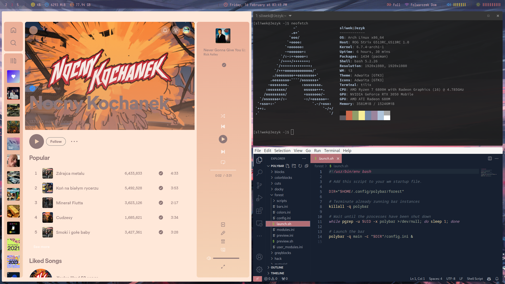

# Config 
These are my config files. 

### i3

### Cinnamon

# Important repos 
Links to several repositories you should visit:

* https://github.com/brndnmtthws/conky (customized | Cinnamon)

* https://github.com/mbolli/conky-lastfm (customized code | Cinnamon, conky ) 

* https://github.com/adi1090x/polybar-themes (I use customized forest theme | i3)

* https://github.com/spicetify/spicetify-cli (theme: Flow, color: pink)

* https://github.com/albertlauncher/albert 

* https://github.com/abba23/spotify-adblock

# Don't forget about:

* change paths in i3 config file
* add USER_NAME and API_KEY in conky last_fm