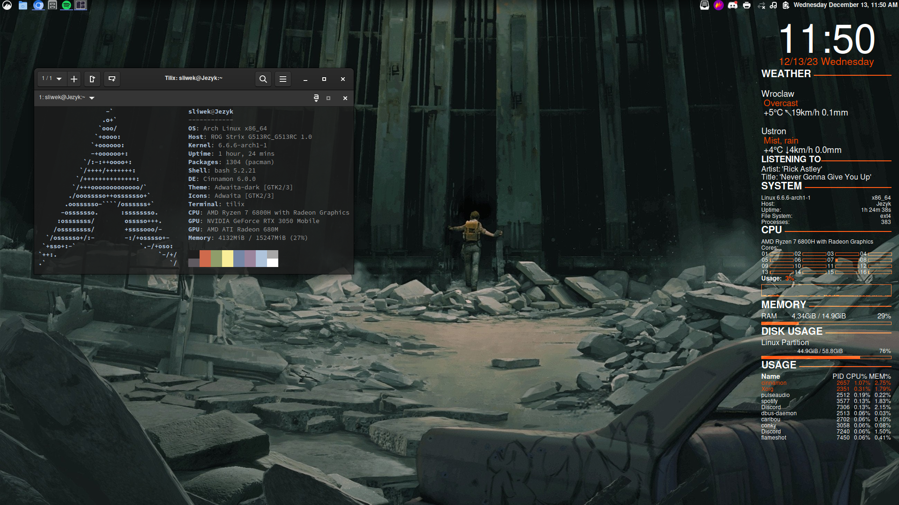

# Config 
These are my config files. Soon I will add more

Now I'm using Cinnamon config files




## Installation
Copy the repository. From Cinnamon/i3 copy everything except pictures dir
```bash
https://github.com/sliweq/config_files.git
```

# Important repos
Links to several repositories I use


https://github.com/brndnmtthws/conky

https://github.com/mbolli/conky-lastfm

https://github.com/spicetify/spicetify-cli

https://github.com/abba23/spotify-adblock

https://github.com/albertlauncher/albert
